# EldenRing API
This EldenRing API lets you manage all the weapons in the game EldenRing.

## Architecture 
This project consists of an REST-API and two clients that access that API. The server was made with Java and Spring. The first client is a Web client that uses MudBlazor and the other one is a WPF client.

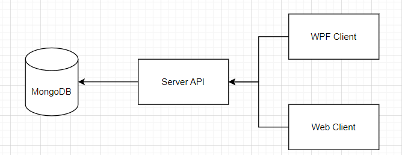

I first started with the API and the Data-Structure. After that was done, I implemented my database. The first client I worked on was the WPF-Client. This took the most time. Last but not least was the Web-Client.

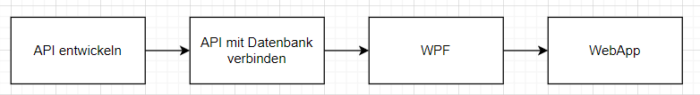

## Data-Structure
The weapon class has the following attributes:
- name
- image
- description
- a list of the attack attributes
     - name 
     - amount
- a list of the defence attributes
     - name 
     - amount
- a list of the scalings
     - name 
     - scaling
- a list of the required attributes
     - name 
     - amount
- category  
- weight

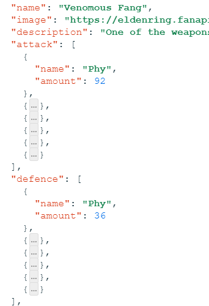
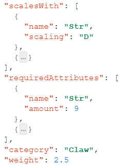

I found a dataset, containing all the items in the game on [here](https://github.com/deliton/eldenring-api/tree/main/api/public/data)

## API
Like already mentioned, I used Java in combination with Spring to create my API.

## Structure
We have 3 classes for our weapon. 
- The [Weapon-Class](https://github.com/Aldin296/EldenRing/blob/main/EldenRing_API/demo/src/main/java/com/example/demo/Weapon.java) itself
- The [Attribute-Class](https://github.com/Aldin296/EldenRing/blob/main/EldenRing_API/demo/src/main/java/com/example/demo/Attribute.java)
- The [Scaling-Class](https://github.com/Aldin296/EldenRing/blob/main/EldenRing_API/demo/src/main/java/com/example/demo/Scaling.java)

We also have a [WeaponService](https://github.com/Aldin296/EldenRing/blob/main/EldenRing_API/demo/src/main/java/com/example/demo/WeaponService.java) that provides the basic functionality for the API. 

The [WeaponController](https://github.com/Aldin296/EldenRing/blob/main/EldenRing_API/demo/src/main/java/com/example/demo/WeaponController.java) defines the Endpoints and uses the methods defined in the WeaponService. The annotationes @RequestMapping, @PostMapping, @PutMapping und @DeleteMapping are important, because they define our CRUD-Operations and handle the HTTP-Requests.

The [WeaponRepository](https://github.com/Aldin296/EldenRing/blob/main/EldenRing_API/demo/src/main/java/com/example/demo/WeaponRepository.java) provides us with 2 methods that we use in the WeaponService.

### Endpoints
The Endpoints are defiend in the WeaponController class. The Endpoints are using methods from the Service class to handle them e.g. deleting them

Home:
```java
    @RequestMapping("/home")
    public String serviceTest(){
        return "Das Service funktioniert!";
    }
```
Weapons:

You get all the weapons
```java
    @RequestMapping("/weapons")
    public List<Weapon> getallWeapons() {
        return weaponService.getallWeapons();
    }
```
Specific Weapon by name:

You only get the weapon with the name you provide
```java
    @RequestMapping("/weapon/{name}")
    public Optional<Weapon> getWeapon(@PathVariable String name) {
        return weaponService.getWeapon(name);
    }
```

Post:

Lets you add your own weapon
```java
    @RequestMapping(method=RequestMethod.POST, value="/addWeapon")
    public String addWeapon(@RequestBody Weapon weapon) {
        weaponService.addWeapon(weapon);
        String response = "{\"success\": true, \"message\": Weapon has been added successfully.}";
        return response;
    }
```

Put:

Lets you update a specific Weapon
```java
    @RequestMapping(method=RequestMethod.PUT, value="/updateWeapon/{name}")
    public String updateWeapon(@RequestBody Weapon weapon, @PathVariable String name) {
        weaponService.updateWeapon(name, weapon);
        String response = "{\"success\": true, \"message\": Weapon has been updated successfully.}";
        return response;
    }
```

Delete:

Lets you delete a weapon
```java
    @DeleteMapping("/deleteWeapon/{name}")
    public String deleteWeapon(@PathVariable String name) {
        weaponService.deleteWeapon(name);
        String response = "{\"success\": true, \"message\": Weapon has been deleted successfully.}";
        return response;
    }
```

## Database
I am using MongoDB for the Database. The use it we have to write the following in the resources folder:
```java
spring.data.mongodb.uri=mongodb://localhost:27017/eldenring_api
```

# WPF-Client
We are using WPF for our "Admin". Here are all the methodes to manage the weapons (add, delete, udpate). For the design I used Material-Design.

The moment you start the application, you will see a table with all the weapons in the game. 

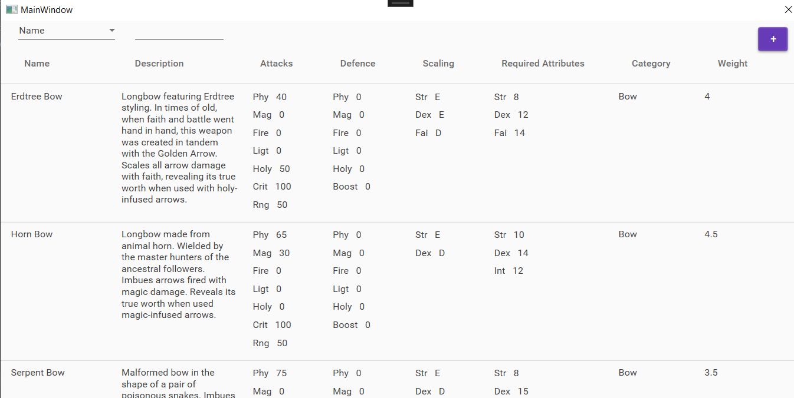

In the top left, you have the option to filter your weapons by name, category, or weight.

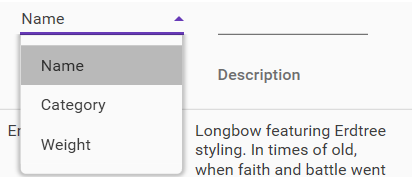

On the top right, you can press the + to add a new weapon. If you do that, a new window will open up, where you can enter the data.

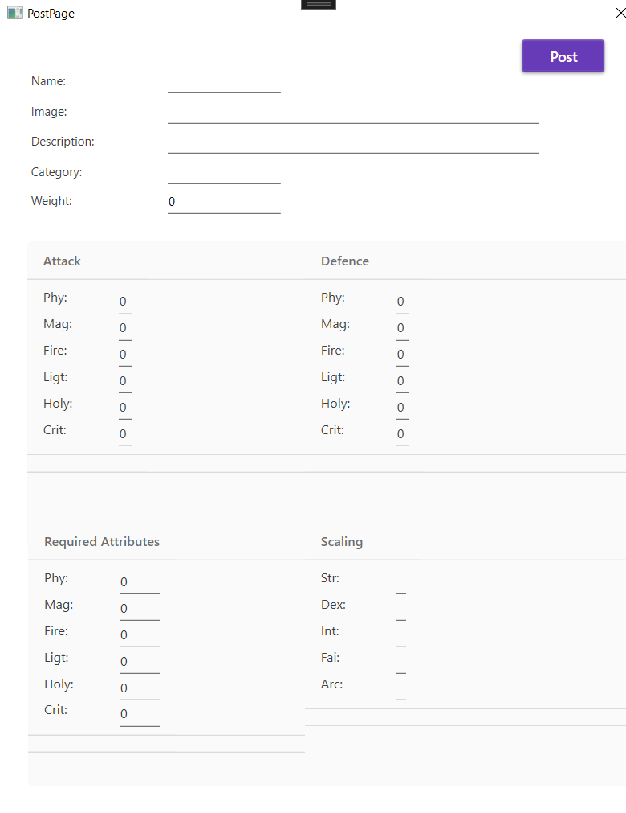

If you want to update, delete, or just view a weapon in a nicer view, you just need to click on the weapon u want. A PopUp will open, giving you the 3 options.

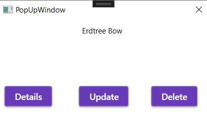

If you want to delete a weapons, simply press delete and the weapon will be gone.

If you press Details you will be redirected to the Details Page.

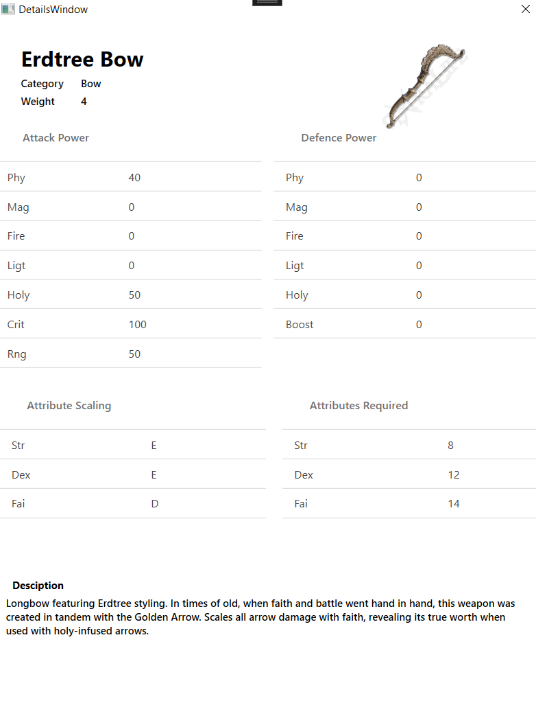

If you want to update the data on a weapon, you simply press udpate and a new window will open up. You just need to change the data and press Update to confirm.

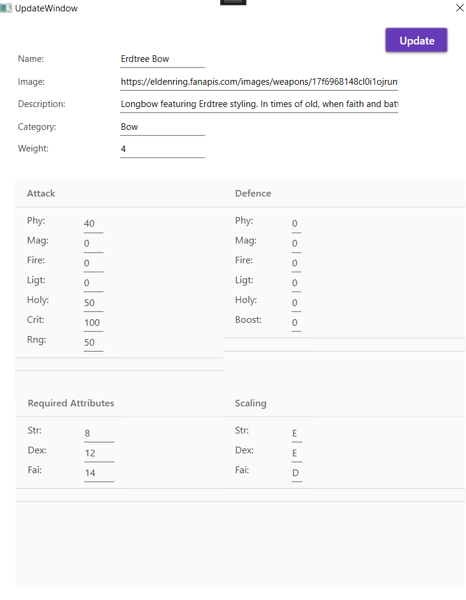


# Web-Client
I chose MudBlazor to create Web-Client. Here you can only view and filter weapons, because users should not be able to mess with the data in any way.

When you open the website you will be greeted by the homepage. Here you can find a small description of what the website is about and a link that will redirect you to the Elden Ring homepage. You will also find a view of all the weapons 

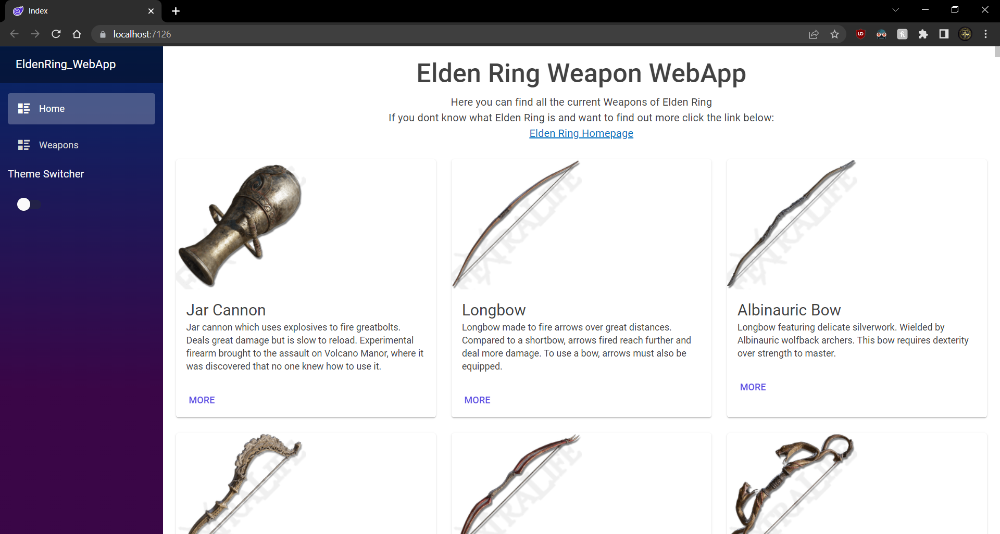

If you want a more detailed look at a weapon, just press more in the bottom left corner. You will be redirected to the Details Page.


If you want to search for a weapon, you can visit the Weapons page. Here is a table with all the weapons. There is also an option to filter the weapons by name, category or weight, just like in the wpf.

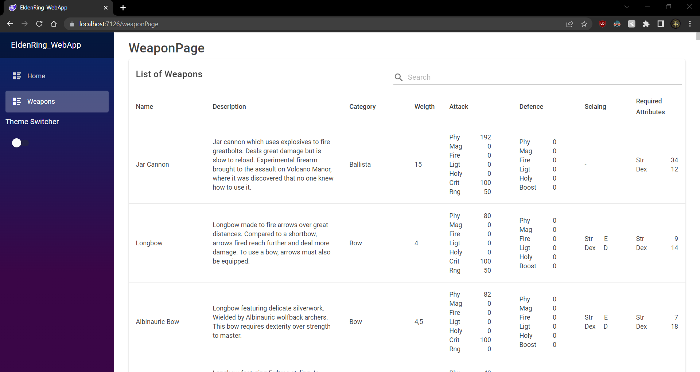

If you press on a row you will also be redirected to the same Details Page like before.

If you prefer a Dark-Theme you can flip the witch on the left side.

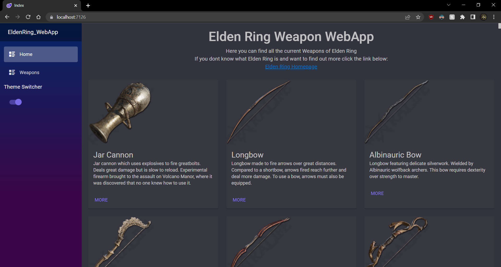